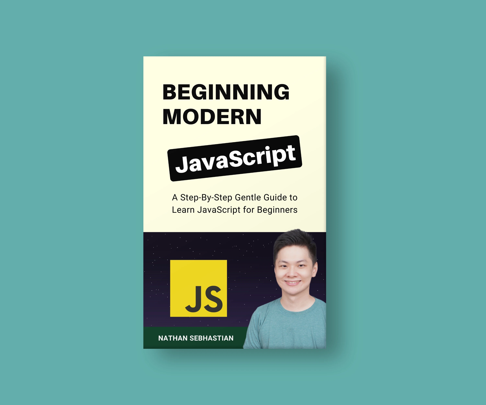

# JavaScript Fetch API For Beginners

The Fetch API is a JavaScript function that you can use to send a request to any Web API URL and get a response.

This repository shows how you can run all 5 standard HTTP request protocols (GET/POST/PUT/PATCH/DELETE) using Fetch.

For the full article, you can visit the following link:

[freeCodeCamp - JavaScript Fetch API For Beginners](https://www.freecodecamp.org/news/javascript-fetch-api-for-beginners)

If you want to take your JavaScript skills to the next level, you might want to check out my book [_Beginning Modern JavaScript_](https://codewithnathan.com/beginning-modern-javascript):

The book is designed to be easy for beginners and accessible to anyone looking to learn JavaScript. It provides a step-by-step gentle guide that will help you understand how to use JavaScript to create a dynamic web application.

Here's my promise: _You will actually feel like you understand what you're doing with JavaScript._
